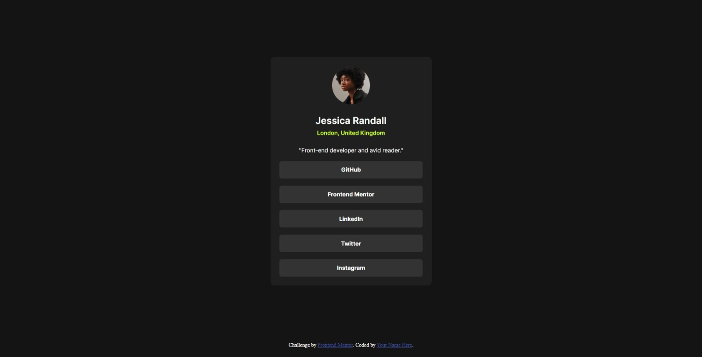

# Frontend Mentor - Social links profile solution

This is a solution to the [Social links profile challenge on Frontend Mentor](https://www.frontendmentor.io/challenges/social-links-profile-UG32l9m6dQ). Frontend Mentor challenges help you improve your coding skills by building realistic projects. 

## Table of contents

- [Overview](#overview)
  - [The challenge](#the-challenge)
  - [Screenshot](#screenshot)
  - [Links](#links)
- [My process](#my-process)
  - [Built with](#built-with)
  - [What I learned](#what-i-learned)
  - [Continued development](#continued-development)
  - [Useful resources](#useful-resources)
- [Author](#author)
- [Acknowledgments](#acknowledgments)

**Note: Delete this note and update the table of contents based on what sections you keep.**

## Overview

### The challenge

Users should be able to:

- See hover and focus states for all interactive elements on the page

### Screenshot

### Links

- Solution URL: [Add solution URL here](https://github.com/bilegyr06/profile-website/blob/main/social-links-profile-main/index.html)
- Live Site URL: [Add live site URL here](https://profile-website-coral.vercel.app/)

## My process

 I used a Mobile-first workflow.For the actually html and css I took on the profile image first, and went through all of the remainder in the downwards order. 

### Built with

- Semantic HTML5 markup
- Flexbox
- Mobile-first workflow

## Author

- Frontend Mentor - [@bilegyr06](https://www.frontendmentor.io/profile/bilegyr06)
- LinkedIn - [Ayodeji Ajayi](https://www.linkedin.com/in/ayodeji-ajayi-83006a287/)

